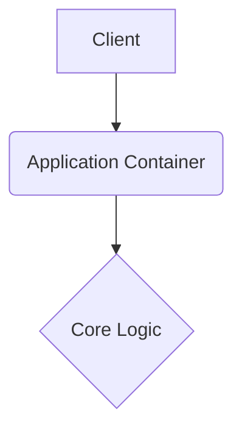

# userprofile

This repository is built with the **Monozukuri** philosophy, focusing on resilient architecture, graceful error handling, and robust continuous integration.

## 🏗️ System Architecture



## 🚀 Setup Instructions

```bash
docker-compose up --build -d
```

## 📂 Structure

Following Wabi-Sabi principles for a predictable layout.

---

## Original Readme

# userprofile