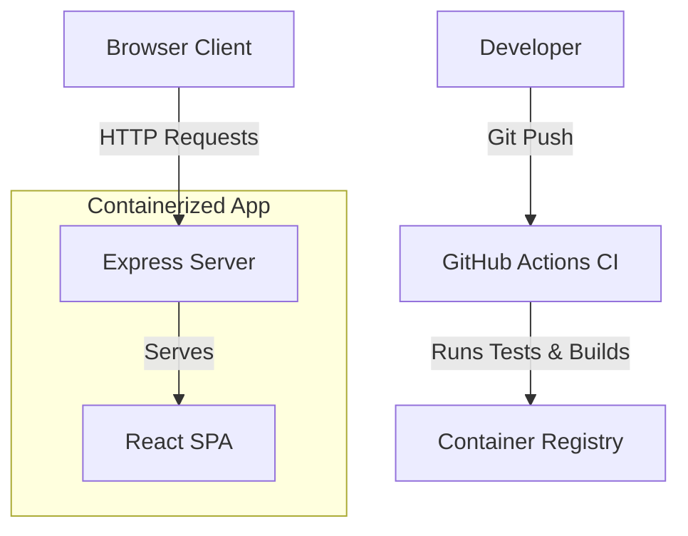

# Fusion Starter

A high-performance web application scaffolding emphasizing resilient error handling, conventional architectures, and modularized code.

## Architecture

This system follows a modular architecture separating the client (React SPA) and server (Express middleware running through Vite). It relies on continuous integration and containerization for stable deployments.



## Features

- **Robust Entry Points:** Error handling wraps root application lifecycle, avoiding naive "happy path" failures.
- **Structured Codebase:** Source code is neatly localized in `/src/` and tests are logically isolated in `/tests/`.
- **Dockerized Deployments:** Uses multi-stage builds to optimize image sizes and production environment isolation.
- **Conventional Commits:** Maintains clean history with standardized commit messages.

## Dependency Rationale

- **React & ReactDOM**: Component-based UI library selected for its robust ecosystem and developer familiarity.
- **Express**: Fast, unopinionated web framework for Node.js, providing an excellent layer for Vite middleware and custom API routes.
- **Vite**: Next-generation frontend tooling offering fast cold starts and instant HMR.
- **Tailwind & Radix UI**: Provides utility-first styling and accessible unstyled components, drastically accelerating UI development.
- **TypeScript**: Adds static types to JavaScript, enabling better tooling and catching errors during development.
- **Vitest**: Blazing fast unit testing framework powered by Vite.

## Step-by-Step Setup

1. **Prerequisites**: Ensure you have Docker and Docker Compose installed.
2. **Clone the Repository**:
   ```bash
   git clone <repository_url>
   cd userprofile
   ```
3. **Run with Docker Compose**:
   ```bash
   docker-compose up --build
   ```
4. **Access the Application**:
   Navigate to `http://localhost:8080` in your web browser.

## CI/CD Pipeline

The project includes a fully configured `.github/workflows/ci.yml` pipeline that triggers on `main` branch pushes. It ensures that:
- Dependencies install correctly.
- TypeScript compiler succeeds (`typecheck`).
- Unit tests pass.
- Application builds successfully.